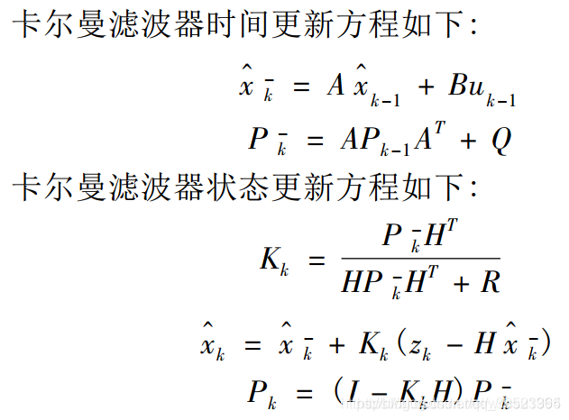

# 卡尔曼滤波

&emsp;&emsp;通俗来说:
+ 卡尔曼滤波是一种滤波算法，据说时域是它的特色；
+ 它也是一种最优估计算法（像最小二乘法就是一种最优估计算法）；
+ 它还是一个迭代器，根据已知预测下一时刻估计值。
+ 它的本质是加权，是数据融合的操作。融合的内容有两个：

&emsp;&emsp;&emsp;&emsp;满足一定分布的先验状态估计值&满足一定分布的观测值。
            
## 卡尔曼滤波的公式五个：
### 2个状态预测更新公式:
            

$\hat{x}\tiny k-1$ 和 $\hat{x}\tiny k$表k-1和k时的后验状态估计值（是滤波的结果之一），即更新后的结果，*来自更新方程*。

$\hat {x}\tiny {\bar k}$ 是k时刻的先验状态估计值，是滤波的中间计算结果，*来自预测方程*。

${P}\tiny {k}$、${P}\tiny {k-1}$ 分别表示 k － 1 时刻和 k 时刻的后验估计协方差（即的协方差，表示状态的不确定度），是滤波的结果之一

${P\tiny {\bar k}}$ 是k时的先验估计协方差，是滤波的中间计算结果。
