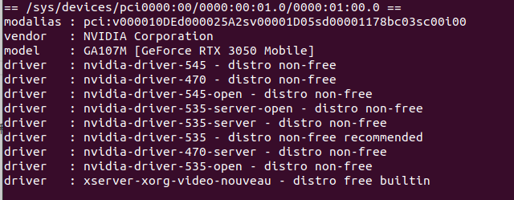
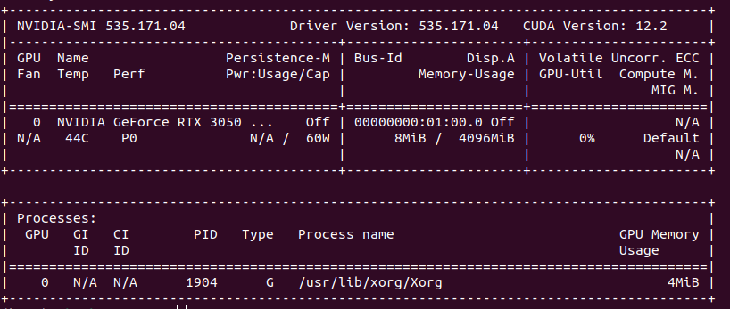

# 双系统ububtu的希望能极速配置之笔记

## 4月20日（当天，ubuntu22.04迎来了它的第三次爆炸。一切从此空白开始）
### 1. 用小白的脚本下了vscode，和ros2

&emsp;&emsp;（密钥老了的话，curl一下新密钥）
```shell
sudo apt update && sudo apt install curl -y
sudo curl -sSL https://raw.githubusercontent.com/ros/rosdistro/master/ros.key -o /usr/share/keyrings/ros-archive-keyring.gpg」
```	

### 2. 改中文&下个google拼音：

&emsp;&emsp;设置里language改成中文，sudo apt update和upgrade一下，
再
```shell
sudo apt install fcitx
```

&emsp;&emsp;下好之后进language的页面，管理已安装语言，键盘输入法系统改成fcitx4（也可能是显示fcitx）

&emsp;&emsp;重启
```
sudo apt-get install fcitx-googlepinyin fcitx-configtool
```
&emsp;&emsp;下好之后重启一下就ok，ctrl+空格或者ctrl+shift就能切，手动切也行。
（从键盘选项也能快捷地切换输入法。）

#### （4.29补充）：
&emsp;&emsp;用自带的IBus在键盘里使用和更改输入法似乎更方便。


### 3. 用vscode写c，c++，python
```shell
sudo apt install gcc
```

&emsp;&emsp;c，cpp，py分别写个试一下，vscode会提示要安装的拓展。或者自己搜c/c++拓展和python拓展
    
### 4. 安装nvidia驱动
&emsp;&emsp;日常，先更新更新apt。

&emsp;&emsp;然后：

```shell
sudo ubuntu-drivers devices
```

&emsp;&emsp;看能装哪些驱动



&emsp;&emsp;选了能用的535：

```shell
sudo apt install nvidia-driver-535 
```

&emsp;&emsp;没报错。

&emsp;&emsp;看看驱动版本

```shell
nvidia-smi
```


&emsp;&emsp;一步到位，嘻嘻。


### 5. anaconda3 去官网下个.sh下好了运行就行，如cd到下载，sh Anaconda3-2024.02-1-Linux-x86_64.sh 

&emsp;&emsp;(看了一下，base下可以运行python，有numpy，没pytorch和opencv。python3.11.7）


## 4月21日（以下皆在dl环境下）

### 0.5 qq。

&emsp;&emsp;去官网下个deb包，**sudo dpkg -i 软件包名.deb**。完毕。

### 1. 😀️安装pytorch

&emsp;&emsp;放到anaconda，给pytorch一个专属环境，要用的时候激活一下。

```shell
nvcc -V
```

&emsp;&emsp;说没下载nvidia-cuda-toolkit，于是先下。

```shell
sudo apt install nvidia-cuda-toolkit
```

&emsp;&emsp;得cuda11.5。

```shell
conda create -n fordl python==3.11.7
conda activate fordl
conda install pytorch torchvision torchaudio pytorch-cuda=12.1 -c pytorch -c nvidia
```

### 2. 安装opencv
```shell
pip install opencv-python
```

### 3. 配置yolov5
```shell
git clone https://github.com/ultralytics/yolov5
cd yolov5 && pip install -U -r requirements.txt
pip install -i https://pypi.tuna.tsinghua.edu.cn/simple 
```
&emsp;&emsp;下载labelImg(**会有闪退bug，未解决**)：

```
pip install lamelimg
```

&emsp;&emsp;下载labelme：

```shell
pip install labelme
```


### 4.配置openvino
```shell
conda install -c conda-forge openvino=2024.0.0
```


## 4月24日
### 1. 安装autolabelimg(多功能自动标注)
&emsp;&emsp;参考：https://github.com/wufan-tb/AutoLabelImg

&emsp;&emsp;**注：给的`requirements.txt`有问题，要把其中所有的>= 全改成==，torchvision要删，后续直接运行.py文件，报错缺什么下什么。**

## 4月25日
### 1. 
&emsp;&emsp;**运行**
```shell
ros2 run examples_rclcpp_minimal_subscriber subscriber_member_function
```
&emsp;&emsp;**报错重点：**
```shell
/home/zhizhi/ros2_ws/install/examples_rclcpp_minimal_subscriber/lib/examples_rclcpp_minimal_subscriber/subscriber_member_function: /home/zhizhi/anaconda3/lib/libstdc++.so.6: version `GLIBCXX_3.4.30' not found (required by /opt/ros/humble/lib/librclcpp.so)
[ros2run]: Process exited with failure 1
```

&emsp;&emsp;**解决方式：**

&emsp;&emsp;以防万一新建了给ros2用的conda环境并激活（不过似乎没有用到）。

&emsp;&emsp;在该环境下，使用软链接：
```shell
ln -sf /usr/lib/x86_64-linux-gnu/libstdc++.so.6 /home/zhizhi/anaconda3/lib/libstdc++.so.6
```

### 2. 如下
&emsp;&emsp;**运行**
```shell
colcon_cd some_ros_package
```
&emsp;&emsp;**报错：**

```shell
colcon_cd command not found
```
&emsp;&emsp;**解决方式：**

&emsp;&emsp;检查一下`~/.bashrc`，确定获取了脚本而且路径正确但还是不能运行的话，可以**重启**试试，解决。

### 3. 运行colcon build内存爆炸电脑卡死
&emsp;&emsp;**解决方式：** 设置控制线程数：
```shell
colcon build --parallel-workers 4
```

&emsp;&emsp;~~*（后面这个数字看你设计.jpg）*~~


### 4. 如下
&emsp;&emsp;**运行**
```shell
colcon build
```
&emsp;&emsp;**报依托答辩，总结报错重点为：**
```shell
    ...
    File "/opt/ros/humble/local/lib/python3.10/dist-packages/rosidl_adapter/resource/__init__.py", line 19, in <module>
    import em

ModuleNotFoundError: No module named 'em'
```
&emsp;&emsp;（注意到引用的包路径没用anaconda里的，所以跟虚拟环境没关系）

&emsp;&emsp;**解决方式：** 回到base环境：
```shell
conda deactivate
pip install empy==3.3.2
colcon build --parallel-workers 4
```

&emsp;&emsp;**继续报错：**  

```shell
    File "/opt/ros/humble/local/lib/python3.10/dist-packages/rosidl_parser/parser.py", line 20, in <module>
    from lark import Lark
ModuleNotFoundError: No module named 'lark'
```

&emsp;&emsp;**解决方式：**
```shell
pip install empy==3.3.2
colcon build --parallel-workers 4     
```
&emsp;&emsp;成功～～～（

### 5. 记住 --package-select 指定编译包
### 6. 打开publisher_member_function.cpp文件，无法打开 源 文件 "rclcpp/rclcpp.hpp"C/C++(1696)：
&emsp;&emsp;**解决方式：** 这是一个个人傻缺问题。不要在code按f5运行，在工作空间构建然后在工作空间`code .`。解决。


## 4月27日
### 1.打开rm_vision自瞄代码的方式：（默认已经下过华师代码）
#### （1）

&emsp;&emsp;（无硬件）
```shell
    source install/setup.bash
    ros2 launch rm_vision_bringup no_hardware.launch.py
```
&emsp;&emsp;（有硬件）
```shell
    source install/setup.bash
    ros2 launch rm_vision_bringup vision_bringup.launch.py
```    
#### （2）
&emsp;&emsp;打开ros_ws的文件夹，在此开启终端，运行`code .`

&emsp;&emsp;找路径：**/home/zhizhi/ros_ws/src/rm_auto_aim/armor_detector/src**

&emsp;&emsp;想看对应函数、命名空间等：**ctrl+点击**。

    

## 4月28日
### 1.yolov5怎么用

&emsp;&emsp;记得激活fordl环境，进入yolov5文件夹打开vscode试运行detect.py，参数要去`datasets`、`detect.py`、`train.py`里改。

    
## 4月30日
### 1.下载docker
#### 1.1 用apt：
&emsp;&emsp;**运行:**
```shell
   sudo apt-get install docker-ce docker-ce-cli containerd.io 
```


&emsp;&emsp;**报错:   apt 不允许下docker-ce** 

#### 1.2 用curl 运行   
```shell
curl -fsSL https://download.docker.com/linux/ubuntu/gpg | sudo gpg --dearmor -o /usr/share/keyrings/docker-archive-keyring.gpg
```
&emsp;&emsp;**得到**
```shell
curl: symbol lookup error: curl: undefined symbol: curl_easy_header Warning: apt-key is deprecated. Manage keyring files in trusted.gpg.d instead (see apt-key(8)). gpg: 找不到有效的 OpenPGP 数据。
```
&emsp;&emsp;**解决思路：** 请注意安装docker的`先决条件`：**安装docker引擎（Docker Engine）并设置docker存储库（Docker repository）**

&emsp;&emsp;**解决方式：**	
        
```shell
        sudo apt-get update
        sudo apt-get install ca-certificates curl
        sudo install -m 0755 -d /etc/apt/keyrings
        sudo curl -fsSL https://download.docker.com/linux/ubuntu/gpg -o /etc/apt/keyrings/docker.asc
        sudo chmod a+r /etc/apt/keyrings/docker.asc
        echo \
            "deb [arch=$(dpkg --print-architecture) signed-by=/etc/apt/keyrings/docker.asc] https://download.docker.com/linux/ubuntu \
            $(. /etc/os-release && echo "$VERSION_CODENAME") stable" | \
            sudo tee /etc/apt/sources.list.d/docker.list > /dev/null
            sudo apt-get update
```
&emsp;&emsp;**再运行**
```shell
sudo apt-get install docker-ce docker-ce-cli containerd.io docker-buildx-plugin docker-compose-plugin
```
&emsp;&emsp;无报错，解决。

#### 2.docker login 输入正确密码后报错：
```shell
Error saving credentials: error storing credentials - err: exit status 1, out: `error storing credentials - err: exit status 1, out: `pass not initialized: exit status 1: Error: password store is empty. Try "pass init".``
```

&emsp;&emsp;**没什么好说的，具体解决不必写在这里，官网教程写得很清楚。有关docker的报错几乎都是因为没仔细看教程而发生，这个臭毛病是需要改掉的。QwQ**


#### 3.装个ros:noetic：
&emsp;&emsp;安装noetic镜像：
```shell
sudo docker pull osrf/ros:noetic-desktop-full
docker run -it osrf/ros:noetic-desktop-full /bin/bash
```


#### 4.docker：
&emsp;&emsp;启动和下载
```shell
docker run -i -t -d -p 9090:80 onlyoffice/documentserver
```
&emsp;&emsp;查看当前运行的镜像
```shell
docker ps
```
&emsp;&emsp;可以看到容器id

&emsp;&emsp;进入某个容器
```shell
docker exec -it c67b15319a41 /bin/bash
cd /etc/yourname/documentserver
```
&emsp;&emsp;可以安装等操作
```shell
apt install vim
```
&emsp;&emsp;或者编辑配置修改文件等

&emsp;&emsp;另存为新的镜像   
```shell 
docker commit c67b15319a41 hxh:V1
```
&emsp;&emsp;最新版，请将V1修改为latest：docker commit c67b15319a41 yourname:latest

&emsp;&emsp;开机后启动新镜像即可

&emsp;&emsp;查看所有
```shell
docker images
```
&emsp;&emsp;关闭容器
```shell
docker stop id
```
&emsp;&emsp;删除镜像
```shell
docker rm id
```
&emsp;&emsp;启动时候，如果镜像tag没用latest，则启动必须加版本号。
```shell
docker run -i -t -d -p 9090:80 yourname:V1
```
&emsp;&emsp;如需开机自启，请配置好容器开机自启脚本。

&emsp;&emsp;另，如容器内有需要一起启动的，请参照说明文档。
            
        
        
#### ~~<font color="red">5.挂载usb相机视频流文件：失败</font>~~
```shell
sudo docker run -it -p 6082:80  --privileged -v /dev/video2:/dev/video3 --device=/dev/video0 ros_noetic
```
~~<font color="red">（数字是端口号，冒号那里是从哪到哪，最后的是名字）</font>~~

#### 6.开启docker镜像另一个不互相影响的终端 
```shell
sudo docker exec -it 8cc3162f7b33 /bin/bash
```

#### ~~<font color="red">6.0 抽象，开启可显示gui的新终端： 失败</font>~~
```shell
    docker run -d -v /etc/localtime:/etc/localtime:ro -v /tmp/.X11-unix:/tmp/.X11-unix -e DISPLAY=unix$DISPLAY -e GDK_SCALE -e GDK_DPI_SCALE  rn 
```
